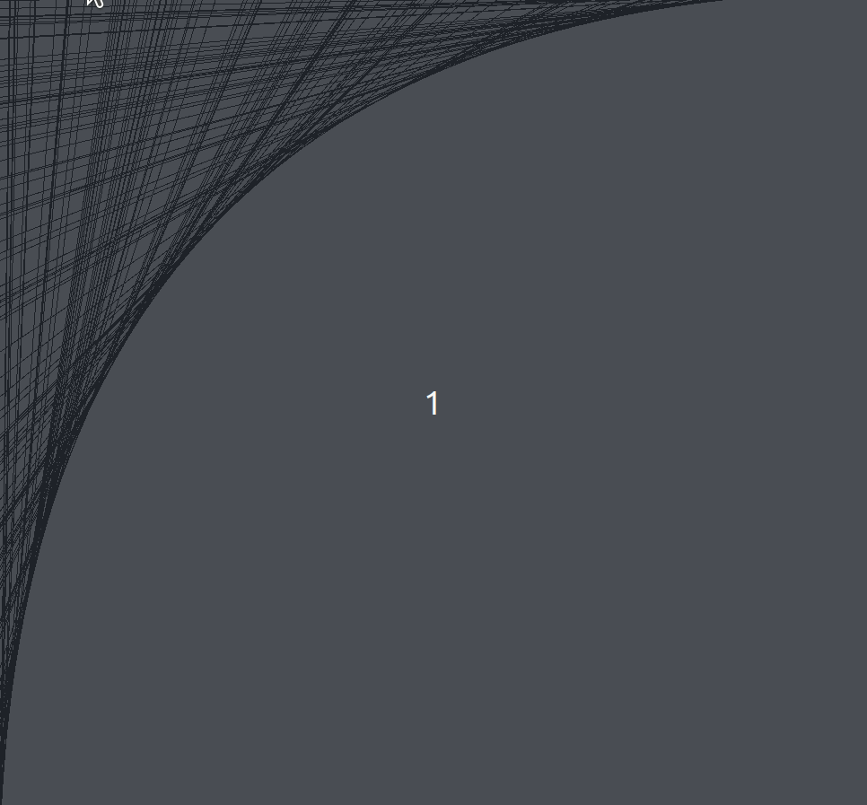
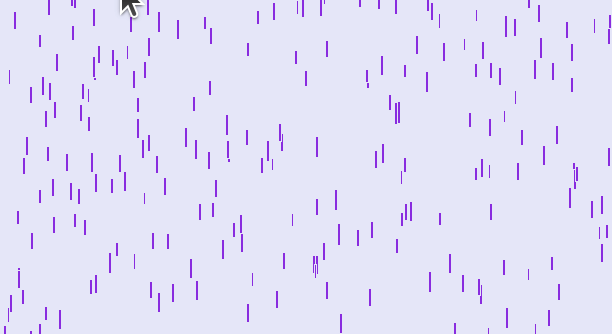
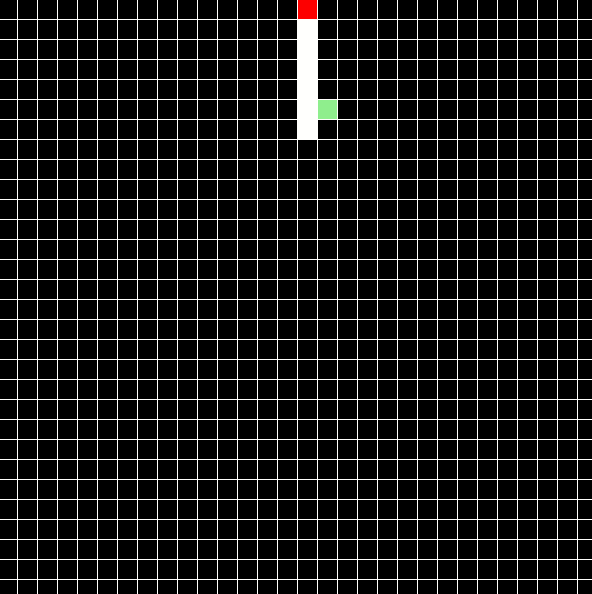
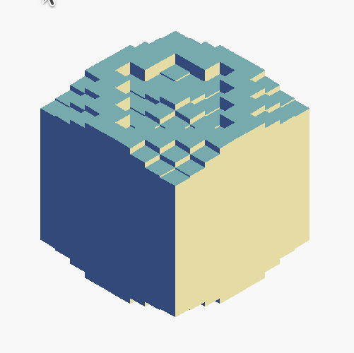

# Tkinter Projects

One of the very first projects when I first learn programming.

These are some interesting visual programs created using Python Tkinter library.

### Project 1: Parabola Simulation

### Project 2: Purple Rain

### Project 3: The Snake Game

### Project 4: Cube Wave

